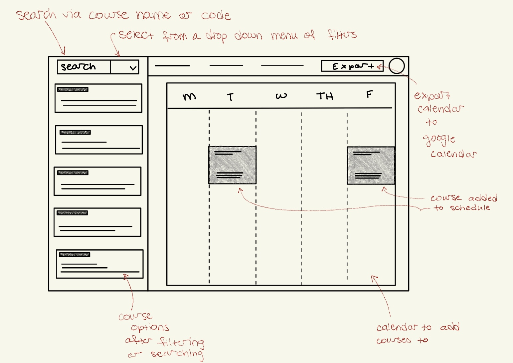
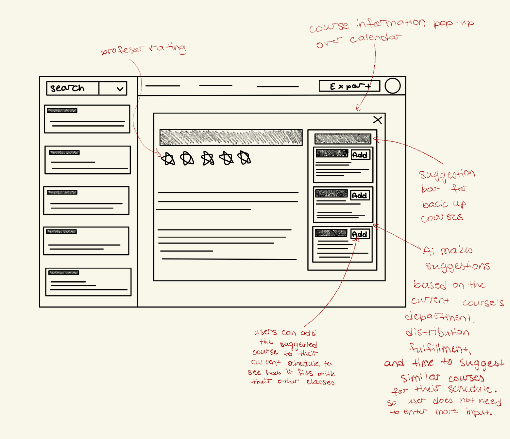

**Task 1: Augment the design of a concept**

 

**ORIGINAL Concept** CourseFiltering [Course]

**Purpose**\
Enables users to efficiently locate courses relevant to their academic goals by narrowing down a large collection into a manageable set based on categories.

**Principle**\
Each class begins with a set of system assigned tags, and the user begins with a list of all available classes. The user selects one or more tags, and the filter produces a list of courses that only includes classes matching all selected tags. The user can then add or remove tags and get a new list of courses that only includes classes matching all selected tags. The user can then clear the filters to remove all active tags.

**State**
  - A set of courses with
    - A set of tags
- A set of tags with
  - An Id String
  - A category String
- A set of Active tags
- A set of Filtered courses

**Actions**
  - AddTag (t: tag)
    - **effects** adds tag to the active set and updates to ensure classes matching all selected tags are in set of filtered courses

  - RemoveTag (t: tag)
    - **effects** removes tag from the active set of tags and updates to ensure classes matching all selected tags are in set of filtered courses
      
  - ClearTags()
    - **effects** resets filter and clears the tags in the Active set of tags and clears the courses in the set of filtered courses

 
 

**AI AUGMENTED Concept CourseFiltering [Course]**

**Purpose**\
Enables users to efficiently locate courses relevant to their academic goals by narrowing down a large collection into a manageable set based on categories.

**Principle**\
Each class begins with a set of system assigned tags, and the user begins with a list of all available classes. The user selects one or more tags, and the filter produces a list of courses that only includes classes matching all selected tags. The user can then add or remove tags and get a new list of courses that only includes classes matching all selected tags. The user can then clear the filters to remove all active tags. In addition to manual filtering, the user may select a course and invoke AI to suggest alternative courses that share overlapping tags.

**State**
  - A set of courses with
    - A set of tags
  - A set of tags with
    - An id String
    - A category String
- A set of Active tags
- A set of Filtered courses
- A set of Suggested courses

**Actions**
  - AddTag (t: tag)
    - **effects** adds tag to the active set and updates to ensure classes matching all selected tags are in set of filtered courses
  - RemoveTag (t: tag)
    - **effects** removes tag from the active set of tags and updates to ensure classes matching all selected tags are in set of filtered courses
- ClearTags()
  - **effects** resets filter and clears the tags in the Active set of tags and clears the courses in the set of filtered courses
- suggestAlternatives (c : course)
  - **requires** that course to have associated tags
  - **effects** produces a set of suggested courses that share overlapping tags with the inputted course and updates Suggested courses to store these suggested courses

 
 
 

**Task 2: Design the user interaction**

 

 

**User Journey**

A Wellesley student navigates to the filter drop down next to the search bar and selects “History” for the department and “200” for the level. Hitting enter, the app displays a filtered list of courses, reducing the overwhelming set to a manageable number relevant to their major.

The student clicks on a course to view the professor’s rating and the distribution requirements the course satisfies (page 2). Liking the course, they click it to add it to their schedule. After reviewing their schedule, they add three more courses, leaving a full load of four. As a freshman, they worry about not getting into their preferred history class. They click on the class in their schedule (page 1), and look at the pop up (page 2) where the AI sidebar suggests backup options that fit their requirements and time slots. They add one as an alternative, feeling more confident that they’ll have a solid schedule even if their first choice fills up.

