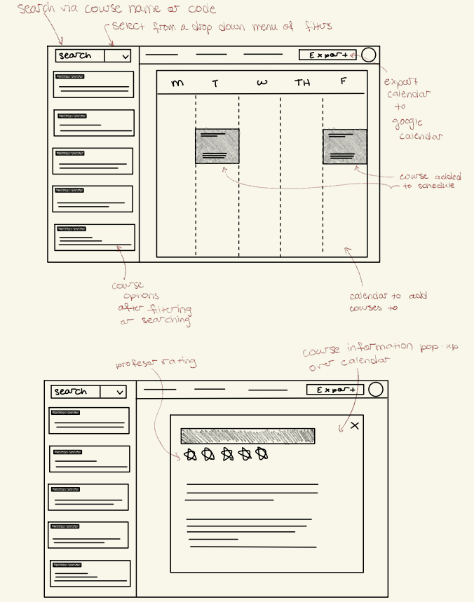

 
 

**User Journey**\
A Wellesley student is preparing for registration and feels overwhelmed by the large number of courses available. They open Academica, register, and log in after confirming their email address. On the home page (wireframe 1), they see a blank schedule.

They navigate to the filter drop down next to the search bar and select “Biology” for the department and “200” for the level. Hitting enter, the app displays a filtered list of courses, reducing the overwhelming set to a manageable number relevant to their major.

The student clicks on a course to view the professor’s rating and any distribution requirements it satisfies (wireframe 2). Liking the course, they click it to add it to their schedule, then repeat the process to add five more courses. After reviewing their schedule, they remove two courses, leaving a full load of four.

Finally, they export their finalized schedule to their Google Calendar, where they can view class names and times. The student feels relieved: they planned their schedule quickly, efficiently, and now have an easy reference for the semester.
